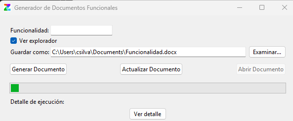

# Generador de Documentos Funcionales

Este proyecto es una aplicación de escritorio con interfaz gráfica (Tkinter) que automatiza la extracción de datos desde la intranet de la empresa Zoo Logic y genera o actualiza documentos Word (.docx) con la información de una funcionalidad y sus requerimientos asociados, usando una plantilla base.

## Índice

- [Requisitos previos](#requisitos-previos)
- [Instalación de dependencias](#instalación-de-dependencias)
- [Estructura del proyecto](#estructura-del-proyecto)
- [Descripción de la lógica y tecnologías](#descripción-de-la-lógica-y-tecnologías)
- [Uso de la aplicación](#uso-de-la-aplicación)
- [Generación del ejecutable (.exe)](#generación-del-ejecutable-exe)

---

## Requisitos previos

- **Python 3.8 o superior**
- **Microsoft Edge** instalado en el sistema
- **msedgedriver.exe** compatible con la versión de Edge (incluido en la carpeta del proyecto)

## Instalación de dependencias

Desde la terminal, ejecutar los siguientes comandos para instalar los paquetes necesarios:

```powershell
pip install selenium
pip install beautifulsoup4
pip install python-docx
```

- **Selenium**: Automatiza la interacción con el navegador Edge para navegar la intranet y extraer datos.
- **BeautifulSoup**: Permite parsear y extraer información de los HTML obtenidos.
- **python-docx**: Permite manipular y generar archivos Word (.docx) desde Python.

NOTA: Para tener acceso a la intranet se hace desde una PC dentro de la red de Zoo o vía VPN.

## Estructura del proyecto

```
FuncionalidadRequerimientos/
├── app/
│   ├── logic.py                # Lógica principal de generación de documentos
│   ├── update_requerimientos.py# Lógica para actualizar documentos existentes
│   ├── docx_helpers.py         # Funciones auxiliares para manipular docx
│   ├── requerimientos.py       # Extracción de requerimientos
│   ├── funcionalidad.py        # Extracción de funcionalidad
│   ├── selenium_helpers.py     # Helpers para Selenium
│   ├── utils.py                # Utilidades y logging
│   └── __init__.py
├── gui/
│   ├── window.py               # Interfaz gráfica principal (Tkinter)
│   └── __init__.py
├── resources/
│   ├── templates/plantillaAFU2505.docx # Plantilla base Word
│   ├── icons/Zoo.ico           # Ícono de la app
│   └── images/                 # Imágenes y capturas
├── tests/
│   └── test_logic.py           # Pruebas unitarias
├── main.py                     # Entry point de la app
├── msedgedriver.exe            # Driver Selenium para Edge
├── requirements.txt            # Dependencias
└── README.md                   # Este archivo
```

## Descripción de la lógica y tecnologías

### 1. Interfaz gráfica (Tkinter)

- Permite al usuario ingresar el número de funcionalidad, elegir si ver el navegador, seleccionar la ruta de guardado y ejecutar el proceso.
- Muestra el progreso, logs en tiempo real, mensajes de éxito/error y permite abrir el documento generado o actualizado.
- Permite actualizar un documento existente, agregando solo los nuevos requerimientos al final de la sección correspondiente.
- El ícono de la app es personalizado (Zoo.ico).

### 2. Automatización web (Selenium + Edge)

- Selenium abre Microsoft Edge y navega a la intranet.
- Automatiza el ingreso del número de funcionalidad, la navegación por iframes y la extracción de requerimientos.

### 3. Extracción de datos (BeautifulSoup)

- Se parsean los HTML de las páginas de la intranet para extraer los campos requeridos de la funcionalidad y los requerimientos.

### 4. Generación y actualización de documento Word (python-docx)

- Se utiliza una plantilla base y se insertan los datos extraídos en el formato requerido.
- Se agregan hipervínculos y se formatea el documento según las necesidades del área.
- **Actualización de documento**: Permite seleccionar un documento existente y agregarle solo los nuevos requerimientos, manteniendo la estructura y sin duplicar información.

### 5. Distribución como ejecutable (.exe)

- Se utiliza **PyInstaller** para generar un ejecutable standalone.
- Se incluye el ícono personalizado y todos los recursos necesarios (driver, plantilla, etc.).
- Comando utilizado:

```powershell
pyinstaller --onefile --icon=resources/icons/Zoo.ico --add-data "msedgedriver.exe;." --add-data "resources/templates/plantillaAFU2505.docx;resources/templates" main.py
```

- El parámetro `--add-data` asegura que los archivos necesarios se incluyan en el ejecutable.
- El ícono personalizado se especifica con `--icon`.

## Uso de la aplicación

1. Ejecutar `main.py` (o el .exe generado).
2. Ingresar el número de funcionalidad.
3. Elegir si se desea ver el navegador durante el proceso.
4. Seleccionar la ruta de guardado del documento Word.
5. Hacer clic en "Generar Documento" para crear un nuevo documento, o en "Actualizar Documento" para agregar nuevos requerimientos a un documento existente.
6. Visualizar el progreso y los logs.
7. Abrir el documento generado o actualizado desde la misma interfaz.

   

## Generación del ejecutable (.exe)

Para distribuir la aplicación como ejecutable en Windows:

1. Abre PowerShell y navega a la carpeta raíz del proyecto:

```powershell
cd "c:\Users\csilva\Desktop\FuncionalidadRequerimientos"
```

2. Ejecuta el siguiente comando para generar el ejecutable:

```powershell
pyinstaller --onefile --icon=resources\icons\Zoo.ico --add-data "msedgedriver.exe;." --add-data "resources\templates\plantillaAFU2505.docx;resources\templates" main.py
```

- El ejecutable aparecerá en la carpeta `dist\main.exe`.
- Si necesitas incluir más recursos, usa más parámetros `--add-data`.

3. (Opcional) Limpieza de archivos temporales:

Después de compilar, puedes borrar los archivos y carpetas temporales generados por PyInstaller para mantener tu proyecto limpio:

```powershell
Remove-Item -Recurse -Force build, main.spec
```

4. Para distribuir tu app:
   - Copia el contenido de la carpeta `dist` junto con los recursos necesarios (por ejemplo, la carpeta `resources` si accedes a imágenes o plantillas en tiempo de ejecución).
   - Asegúrate de incluir `msedgedriver.exe` si tu ejecutable lo requiere en tiempo de ejecución.

---

**Consejo:**

- Prueba el `.exe` en una PC limpia o en otra carpeta para asegurarte de que no falte ningún recurso.
- Si usas rutas relativas en tu código, asegúrate de que los recursos estén en la ubicación esperada respecto al ejecutable.

## Notas adicionales

- El driver de Edge debe ser compatible con la versión instalada de Microsoft Edge.
- Si se distribuye como .exe, todos los archivos necesarios deben estar en la misma carpeta o ser incluidos con PyInstaller.
- El sistema de logs muestra claramente los requerimientos existentes, los nuevos a agregar y el resultado de cada operación.
- La estructura del proyecto es modular y fácil de mantener.
